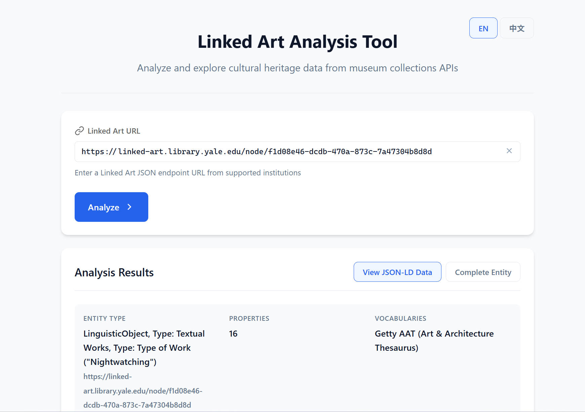
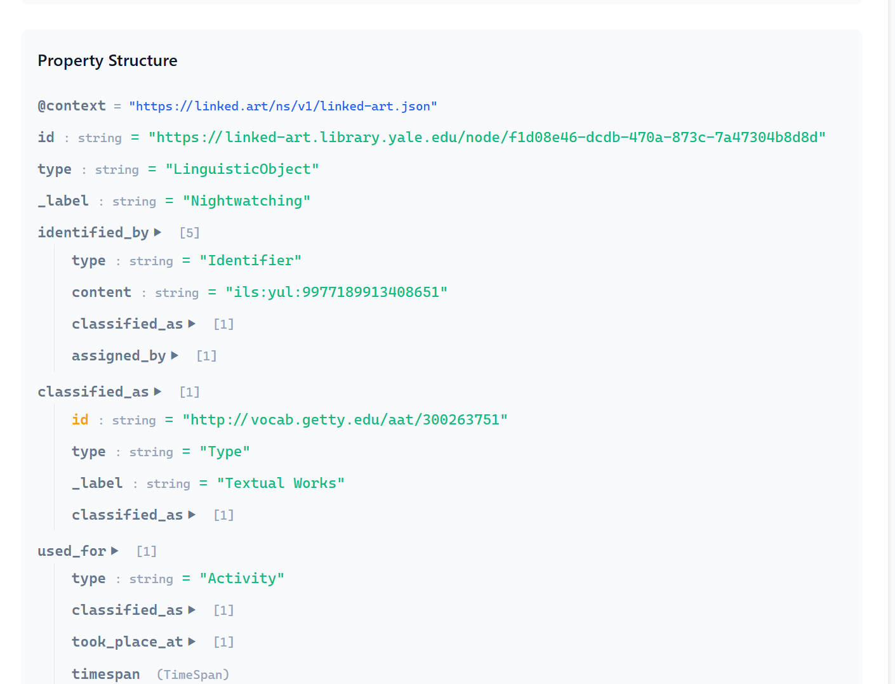
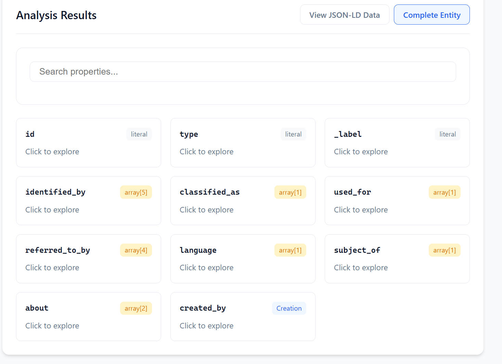
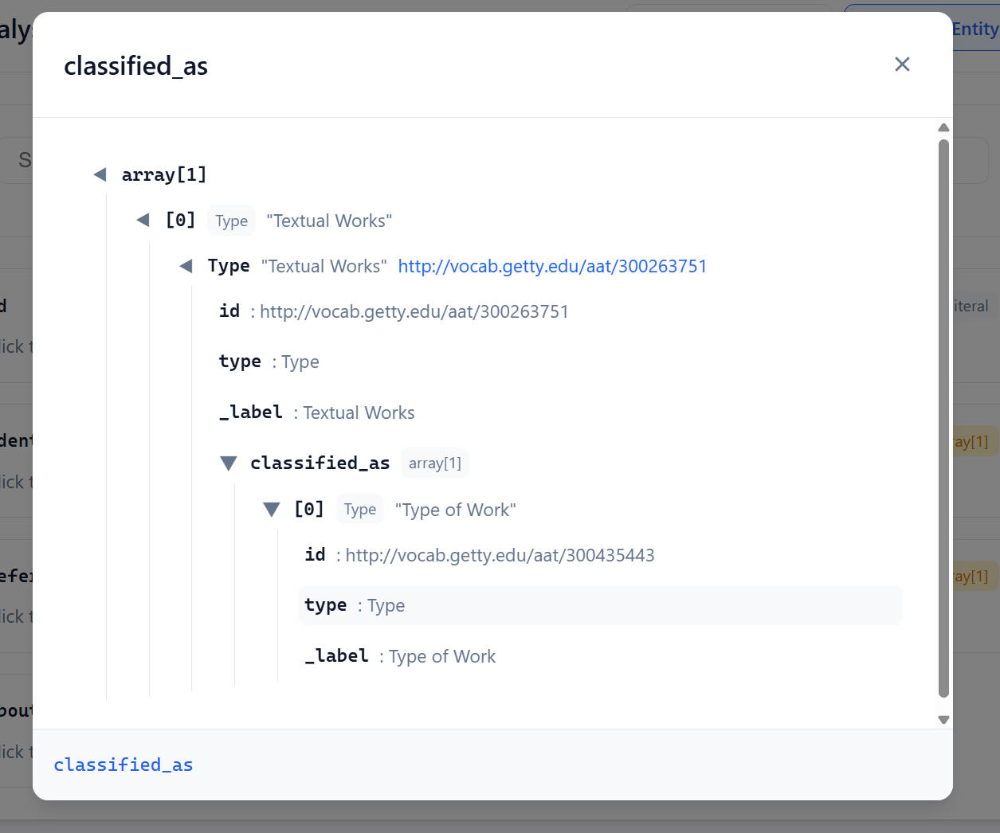

# Linked Art Analysis Tool

> Chinese document is here: [中文文档](README.zh-CN.md)

A web platform for analyzing Linked Art JSON data from GLAM institutions.

## Overview

This tool extracts structured information from Linked Art JSON-LD data published by GLAM (Galleries, Libraries, Archives, Museums) and presents it in a human-readable format.




## Key Features

- Fetch JSON data from Linked Art APIs
- Expand compact IDs (e.g., `aat:300312355`) to full URIs
- Extract structured metadata: names, creators, dates, dimensions, materials, etc.
- Getty vocabulary parsing (AAT/TGN/ULAN)
- IIIF manifest processing


## Quick Start

### Launch the Application

Start a local HTTP server:

```bash
# Using npx serve
npx serve -l 8080 .

# Or using Python
python -m http.server 8080

# Or using http-server
npx http-server -p 8080
```

Then open the server address in your browser (e.g., `http://localhost:8080`)

**Note**: The web application requires an HTTP server. Opening via `file://` protocol will encounter CORS restrictions.

### Usage

1. Paste a Linked Art API URL into the input field
2. Click the "Analyze" button
3. **Switch JSON-LD Structure View**: View data structure and vocabulary references



4. **Switch Complete Entity View**: Explore all properties



And you can click every card:




## Project Structure

```
src/
├── index.html                   # Web application entry point
├── js/
│   ├── latool-core.js           # Core analysis logic
│   ├── jsonld-analyzer.js       # JSON-LD structure analysis
│   ├── complete-parser.js       # Complete entity recursive parsing
│   ├── translations.js          # Internationalization
│   ├── ui.js                    # Legacy UI controller (deprecated)
│   └── ui/                      # Modular UI components
│       ├── main.js              # Main controller
│       ├── language-manager.js  # Language management
│       ├── input-handler.js     # Input handling
│       ├── view-manager.js      # View management
│       └── complete-entity-view.js # Complete entity view
├── css/
│   └── style.css                # Stylesheet
├── data/                        # Sample data files
│   ├── physical-objects/        # Physical object samples
│   ├── visual-items/            # Visual item samples
│   └── exhibitions/             # Exhibition data samples
├── package.json                 # Project configuration
├── CLAUDE.md                    # Claude Code guide
└── README.md                    # Project documentation
```

## Contributing

Issues and Pull Requests are welcome.

## License

MIT


